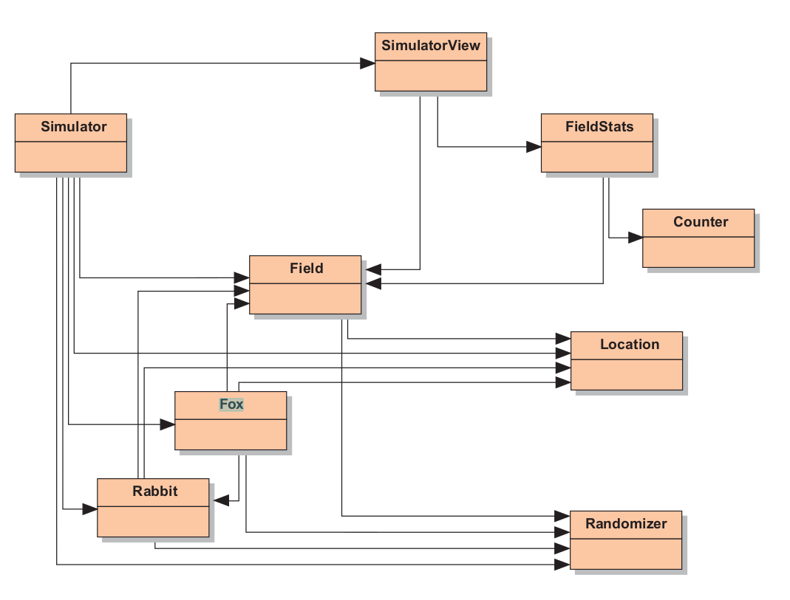
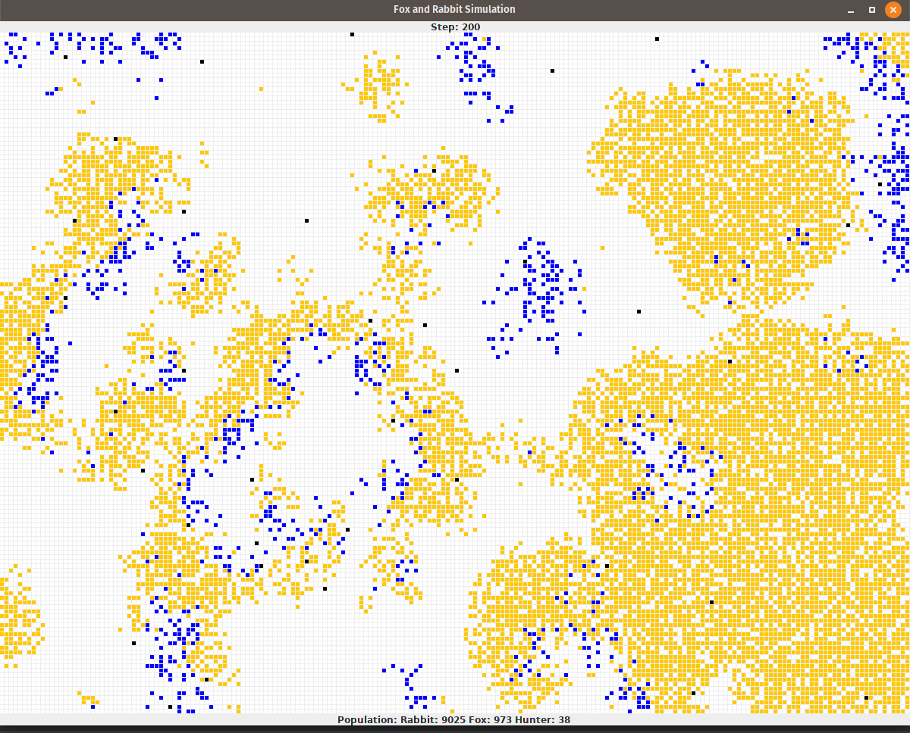

# Field Simulation

This project uses an object-oriented approach with Java to simulate a field
consisting of rabbits, foxes, and hunters.
Rabbits and foxes move around randomly having a certain maximum ages, after some year they start
breading with a certain rate and finally they die. foxes also should
eat rabbits to stay alive. However, hunters don't move, breed or die. They just
hunt from places nearby randomly.

### Basic UML of The Project

### The Result After 200 iterations

orange pixels represent rabbits, blue ones are foxes and hunters are black.
### Prerequisites
Inorder to get started with Java programming you can read:
* [Object first with Java](https://www.academia.edu/39217681/Objects_First_with_Java_5th_Edition)

more specifically you can read chapter 10 of the book to understand this project.

## License
This project is licensed under the Apache License 2.0 - see the [LICENSE](LICENSE) file for details
